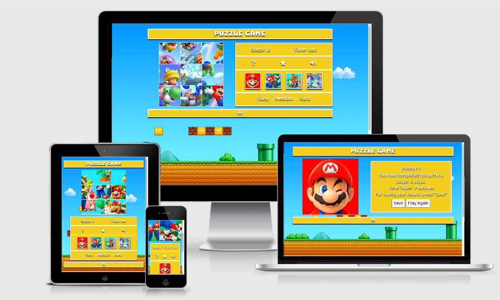
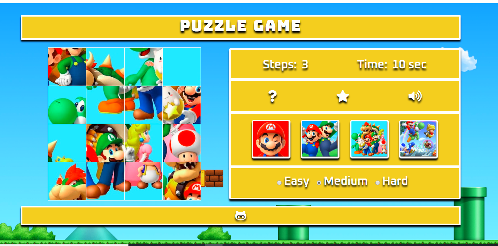
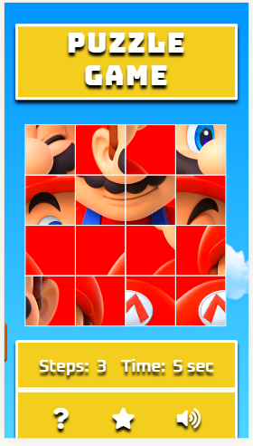
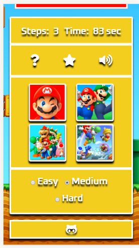
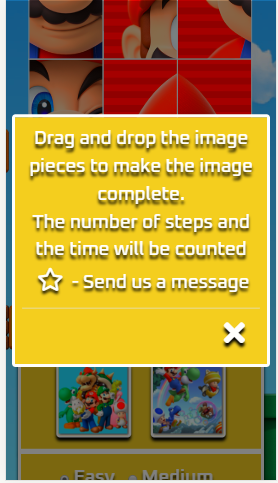
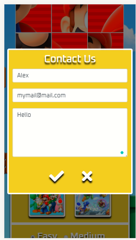
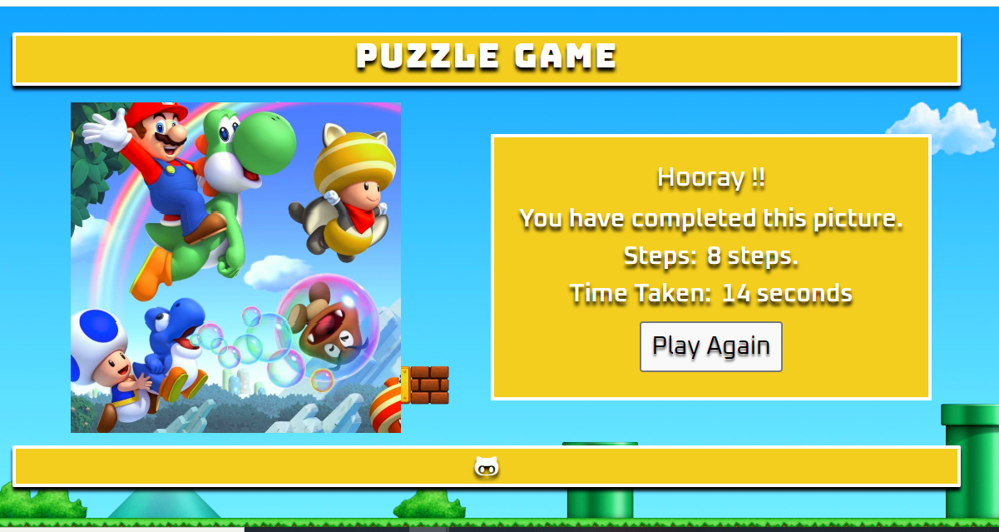
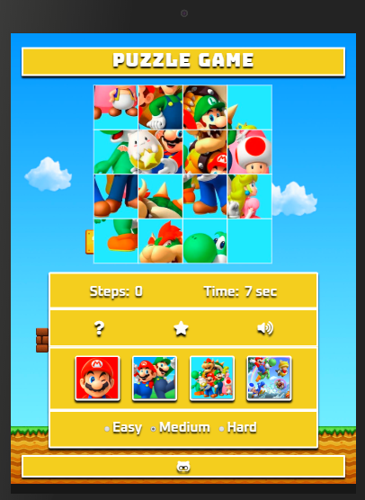

 <link rel="stylesheet" href="https://use.fontawesome.com/releases/v5.7.1/css/all.css">

   # Interactive Frontend Development Milestone Project

 

   
 

 # **PUZZLE GAME** 

 "Puzzle Game" is a fun puzzle for children. It has a choice of images for the game field, three levels of difficulty, child-friendly design, and easy control features. The game has a timer and a step counter.

 ## [Click To Play !](https://annadk.github.io/PuzzleGame/)

 ****
 # **Table of Contents**

 ## 1. [UX](#ux) 

   - **[Project Goals](#project-goals)**
   - **[Player Goals](#player-goals)**
   - **[Developer Goals](#developer-goals)**
   - **[User Stories](#user-stories)**
   - **[Game Design](#game-design)**
   - **[Wireframes](#wireframes)**

 ## 2. [Features](#features)

   - **[Existing Features](#existing-features)**
   - **[Features Left To Implement](#features-left-to-implement)**

 ## 3. [Technologies Used](#technologies-used)

 ## 4. [Testing](#testing)

 ## 5. [Deployment](#deployment)

 ## 6. [Acknowledgments](#acknowledgments)
 ---------------------------------------------------------------

 ## [UX](#ux)

 ### [Project Goals](#project-goals)

  This game is designed for primary _school children_. Collecting puzzles promotes the development of figurative and logical thinking, voluntary attention, perception, in particular, the distinction of individual elements in color, shape, and size.
  Also, it teaches children how to perceive the connection between the part and whole The complexity of the puzzle within the same number of elements is determined by the pattern, and the main criterion is the number of elements itself - the higher it is, the puzzle is bigger and more complex.

  * _Dutch children begin school at the age of four-five years old_ 

 ### [Player goals](#player-goals)

 Player goals:

 - Attractive design for kids
 - Intuitive control
 - An exciting game process
 - Motivation in goal achievement
 - The visual result when passing the game
 - The ability to choose levels and picture for the puzzle

 Puzzle game met these goals:

 - Bright colors, clear design, attractive puzzle images 
 - Game management easy for kids
 - Player straight see the result of the game process and want to continue till puzzle will be solved
 - The player can keep playing and improve results
 - The results visually available during the game process and when the puzzle completed
 - The game allows you to combine different images and levels of difficulty 

 ### [Developer Goals](#developer-goals)

 - Create the Second Milestone Project which meets requirements from Code Institute
 - Create the independent project after learning of JavaScript and  jQuery.
 - More practise in HTML, CSS, JavaScript
 - The second  independent project in the portfolio of the developer
 - Create an interesting and functional game which is fun to play.

 ### [User Stories](#user-stories)

 As a child who plays "Puzzle Game" I want:

 1. Easy to understand what type of game it is
 2. Easy understand how to play
 3. Have a funny sound following my action
 4. Have a fun game design
 5. Interesting recognizable images as a puzzle layout
 6. To see how fast I can complete a puzzle
 7. Try to play different levels

 ### [Game Design](#game-design)

 #### Puzzle theme

 Famous "Super Mario" game chosen as a design reference for this project.
 Characters of the game recognizable and famous among children. Also the "Super Mario" theme suitable for both genders. 
 This project created is only for educational purposes for "Code Institute" and as a part of the developer portfolio.
 For commercial use of the game images for puzzle layout, dashboard buttons images  and the background image should be replaced.

 ##### Background

 The background image is a famous well recognizable image from the "Super Mario" game.

 ##### Puzzle images:

 The selection of images chosen to represent different levels. From easiest to more difficult one
 Mario: The easiest image. Clear image with big details.
 Mario and Luigi:  More details but still bigger objects, easy to complete image.
 Mario-Team:  More details, smaller objects. The more difficult level than the first two images.
 Mario-Toad: A lot of details, small objects, randomly positioned around an image. The most difficult puzzle image.

 ### [Wireframes](#wireframes)

 The wireframes were created using  [Balsamiq Wireframes](https://balsamiq.com/).

 Web site design and mobile display [here](assets/references/wireframes_images/wireframes_puzzle.pdf)

 ----------------------------------------------------------------------

 ## [Features](#features)

 ### [Existing Features](#existing-features)

 #### Main display

 1. **Heading with the game title**.

 2. **Game field** :

 * Puzzle image. 
   The game starts always with the easiest level "Mario" image and 3 x 3 layout. 
   It makes it easy for small children to get familiar with the game.
   With the left click and hold of the mouse or finger touch and hold on mobile devices,
   the player can move and swap puzzle pieces around the game field.

 3. **Game control field**:
    
      Responding on mouse click or finger touch on mobile devices.
      
      - Steps and Time display. The timer automatically starts as soon as the game loaded.
      The user can renew a timer and start it from zero just clicking on the puzzle image button.
      Step count starts from the first move of the puzzle piece.  
      
      - <i class="fas fa-question"></i> - Rules. Modal window.
      Short explanation about the game.
      
      - <i class="fas fa-star"></i> - Contact Us. Modal window.
        Contact form with 3 input fields. All fields are required. 
        After sending a form - the notification window appear. 
      
      - <i class="fas fa-volume-up sound"></i> - Auio On/Off.
        Allow user to make a sound on or off. The icon will change in response to the choice. 
      
      - Puzzle images section:
        * Big buttons representing images of the puzzle. 
          Responding on mouse click or finger touch on mobile devices.  
          Easy to choose and swap between images.
      
      - Game levels section: 
         * Radio check buttons. 
           Responding on mouse click or finger touch on mobile devices. 
           The Player can choose between  "Easy"- 3x3, "Medium"- 4x4, and "Hard"- 5x5 puzzle layout.   

 

   
 

  
  #### Mobile devices display

  
  

  
   
   
   
 

   

  #### Puzzle complete display:

  1. **Game field** :
     Completed puzzle image.  
     New HTML element replacing game-control field.
     "Winner" audio playing. 
     Congratulation text. Time and amount of steps. 
     Button "Play again" responding on mouse click or finger touch on mobile devices will bring the user back to the main screen.

 

  
 

 #### Tablet display 

  

  
  

  

  

 ### [Features Left to Implement](#features-left-to-implement)

 1.   Find a better solution for changing the size of the game field. Remove a reset game window.
     More information and details can be found in [testing.md](assets/references/testing.md) 

 2. **Saving game results**.
     Add a "Results" button to the game control menu where is the Star icon. Keep Modal window, 
     but create a score-table instead of "Contact Us" form
     "Contact Us" feature can be moved to the footer.
     Numbering images for the playing layout
     After the end of the game, a window pops up asking "Save the result? Yes No"
     If “No”, the window closes and the main display opens.
     If "Yes", a text appears asking you to enter a name or nickname.
     The player’s name is saved with the number of puzzle images, difficulty level, time, and steps.
     It can be used LocalStorage for saving the results.

 3. **Add additional difficulty levels**. 
     The code must be added in script.js.
     Visually in the game menu "Easy" "Medium" "Hard" can be replaced with 
     "3x3", "4x4", "5x5" and extra "6x6", "7x7", "8x8" etc. added

 4. **Add additional images**.
     When expanding the game and moving to a larger selection of possible images for the playing field, remove the buttons with pictures by replacing them with the list of possible images. The player can select an image with the radio check button from the list.
     Or use the button "Next Image". Which will switch to the next picture
     The main code for the game logic must be changed in script.js.
     In index.html to replace the section with dashboard-buttons with toggle-section "List of images"

------------------------------------------------------------------------

  ## [Technologies Used](#technologies-used)

  This project uses HTML, CSS and JavaScript programming languages.

  * **[Balsamiq](https://balsamiq.com/)**  
   The project uses Balsamiqo to build wireframes in the planning stage of development.
  * **[GitPod](https://www.gitpod.io/)**  
   The project uses GitPod to build the website.
  * **[JQuery](https://jquery.com/)** 
   The project uses JQuery as JS library to make HTML document traversal and manipulative
  * **[jQuery UI](https://jqueryui.com/)** 
   The project uses jQuery UI to build functionaly of the game.
  * **[Bootstrap](https://getbootstrap.com/)** 
   The project uses the Bootstrap framework to help create some elements 
  * **[FontAwesome](https://fontawesome.com/)** 
   The project uses FonAwesome to use an icons from the library.
  * **[Google Fonts](https://fonts.google.com/)** 
   The project uses Google fonts to style the website fonts.
  * **[GitHub](https://github.com/)** 
   To store and share all project code remotely.
  * **[jQuery UI Touch Punch](http://touchpunch.furf.com/)** 
   As touch Event Support for jQuery UI
  * **[Browserstack](https://www.browserstack.com/)** 
   The project used Browserstack to test functionality on all browsers and devices.
  * **[AutoPrefixer](https://autoprefixer.github.io/)** 
   The project used AutoPrefixer to add prefixes in the CSS for cross-browser support.
  * **[Google Chrome - Dev Tools]()** 
   The project used Google Chrome Dev Tools to debug code. Check responsiveness.
  * **[Favicon generator](https://favicon.io/)** 
   The project uses Favicon generator to create a puzzle favicon
  * **[EmailJS](https://www.emailjs.com/)** 
   To connect mail service to the web site and be able to receive feedback and messages from users.
  * **[Audio](https://freesound.org/)** 
   To download audio for project
  * **[Audio](https://www.noiseforfun.com/)** 
   To use audio for project from website
  * **[Google](https://www.google.com)** 
    Images for the project were found by using Google image search.
  * **[Color Hex Color Codes](https://www.color-hex.com/)** 
   To chooise colors and take a code for the project
  * **[Stackoverflow](https://stackoverflow.com/)**  
   To find a thousand answers for a thousand questions.

 --------------------------------------------------------------------------
 ## [Testing](#testing)

   All information can be found in [testing.md](assets/references/testing.md)

 ------------------------------------------------------------------------------
 ## [Deployment](#deployment)
  

   At first, this project was developed using Cloud9 IDE. Updates were committed to git. 
  Then updates were pushed to GitHub,using the built in function within Cloud9, 
  where they were stored in a public directory.
  Committing and pushing updates were done through Cloud9 .
  After problems with Cloud9 service, losing my account and everything that wasn't pushed to Github (bad experience-good lesson) 
  development of the project was continued with VS and later with Gitpod.

  Open account on GitHub.
  Open project repository.
  Use Gitpod extension to open a working-space.
  I also created a second repository to work on the project.
          Open the GitHub account.
          Create a new repository using the CI full template.
          Open a working-space in Gitpod by using Gitpod extension.
          Later all code was moved to the original Milestone 2 repository.
 Commits were done through Gitpod.

 **To deploy the project, the following method was used.**

 * Logged into my GitHub account 
 * Go to the Repository tab.
 * Click the repository called "PuzzleGame"
 * Go to the "Settings" section.
 * Scroll down to the "GitHub Pages" section.
 * In the "Sources" select "Master Branch".
 * The page is refreshed and the project published.
 * Copy the link to the deployed website.
  
  **How to run this project locally**
  To clone this project from GitHub:

  * Follow this link to the [PuzzleGame](https://github.com/AnnaDK/PuzzleGame)
  * From the right side find and click "Clone and Download".
  * Under Clone with HTTPS , copy the clone URL for the repository.
  * In your local IDE open Git Bash.
  * Change the current working directory to the location where you want the cloned directory to be made.
  * Type git clone, and then paste the URL you copied .
    [$ git clone https://github.com/AnnaDK/PuzzleGame.git](https://github.com/AnnaDK/PuzzleGame.git)
  * Submit with "Enter"
  * Local clone is created.
   
   [Cloning a repository from help.github.com](https://help.github.com/en/github/creating-cloning-and-archiving-repositories/cloning-a-repository)

 ------------------------------------------------------------------------------
 ## [Acknowledgments](#acknowledgments)

 * Text within this project was written by the developer.

 * Project idea and design were created by the developer

 * The HTML and CSS code was written by the developer
   Code taken from Bootstrap - marked by comments

 * The JavaScript code game logic and functionality was recreated using the tutorial from [Anurag Gandhi](https://www.codeproject.com/Articles/810978/Image-Puzzle-An-HTML-Game)

 * All other credits, references, and  sources are collected, organized and can be found in the document [references.md](assets/references/references.md)
  Hope it can help other students.

  Special thanks to:

  Code Institute Mentor Spencer Barriball for his help and support.

  Code Institute Slack Community for shared experience.

 ## [Disclaimer](#disclamer)

 The "Puzzle Game" project is created for educational purposes only.

